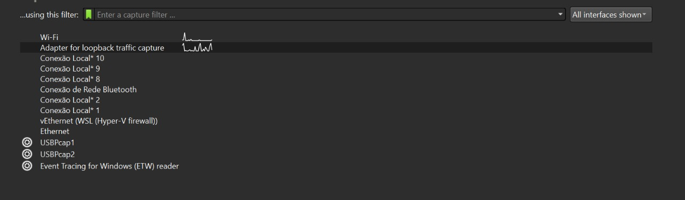
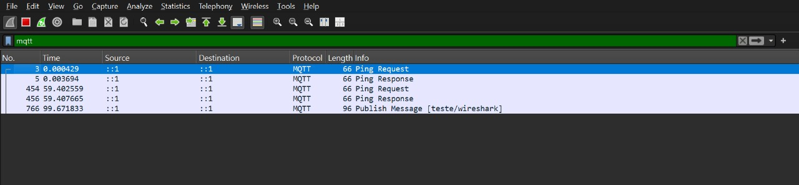
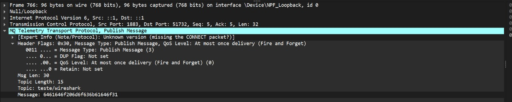
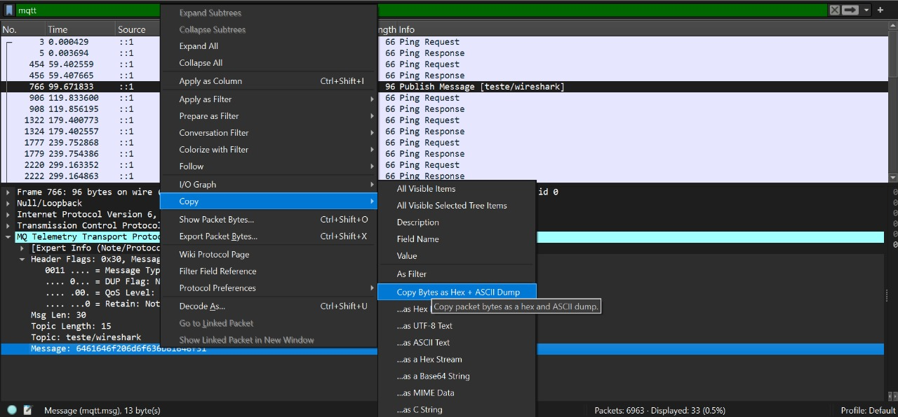

# Analise de vunerabilidade 

# 1. Análise do microsserviço

## 1.1. Introdução
Durante a análise do código MQTT utilizado no ESP32 e no servidor Node.js, foram identificadas as seguintes vulnerabilidades principais:

### 1.1.1. Vunerabilidade 1 - falta de autenticação no broker:

O Mosquitto foi configurado sem nenhum sistema de autenticação para publicar ou receber mensagens. Isso significa que qualquer dispositivo na rede consegue se conectar ao broker sem precisar de usuário ou senha, o que abre várias brechas de segurança. 
É possível destacar dois tipos de ataque que surgem diretamente dessa vulnerabilidade:

### 1- Flooding:
Sem autenticação, qualquer pessoa pode se conectar ao broker e começar a enviar uma quantidade absurda de mensagens. Esse “spam” trava o broker, derruba a rede e impede que as mensagens legítimas circulem.

### 2- Spoofing:
Como o broker não valida quem está se conectando, o atacante pode se passar por um dispositivo ou até pelo próprio serviço de validação. Dessa forma, ele envia respostas falsas fingindo ser o banco de dados, autorizando acessos indevidos ou bloqueando acessos reais.

### Ataque
Para demonstrar o funcionamento e a simplicidade desse ataque, abaixo segue um código para a esp32 onde é simulado o Flooding:

O primeiro e único passo é colocar o código abaixo para rodar na esp, ele vai conectar com o wifi, depois com o broker e assim vai ser possivel mandar mensagens.

```cpp

#include <WiFi.h>
#include <PubSubClient.h>


const char* ssid = "iPhone de Nicholas";
const char* password = "12345678";

// se o atacante descobrir o ip do broker e estiver no mesmo wifi o ataque é possivel
const char* mqtt_server = "172.20.10.3"; // ou IP do seu broker

WiFiClient espClient;
PubSubClient client(espClient);

//define a mensagem que sera espamada
const String mensagem = "AAAAAAAAAAAAAAAAAAAAAAAAAAAAAAAAAAAAAAAAAAAAAAAAAAAAAAAAAAAAAAAAAAAAAAAAAAAAAAAAAAAAAAAAAAAAAAAAAAAAAAAAAAAAAAAAAAAAAAAAAAAAAAAAAAAAAAAAAAAAAAAAAAAAAAAAAAAAAAAAAAAAAAAAAAAAAAAAAAAAAAAAAAAAAAAAAAAAAAAAAAAAAAAAAAAAAAAAAAAAAAAAAAAAAAAAAAAAAAAAAAAAAAAAAAAAAAAAAAAAAAAAAAAAAAAAAAAAAAAAAAAAAAAAAAAAAAAAAAAAAAAAAAAAAAAAAAAAAAAAAA";

//cria a função para enviar para o broker
void enviarMQTT() {
  client.publish("teste", mensagem.c_str());

}


// funcao para conectar no wifi
void setup_wifi() {
  Serial.print("Conectando ao Wi-Fi...");
  WiFi.begin(ssid, password);
  while (WiFi.status() != WL_CONNECTED) {
    delay(500);
    Serial.print(".");
  }
  Serial.println("\nWi-Fi conectado!");
}

// funcao de conexão com o broker 
void reconnect() {
  while (!client.connected()) {
    Serial.print("Conectando ao broker MQTT...");
    if (client.connect("ESP32Teste")) { // esp32teste é o nome do dispositivo para o servidor mqtt
      Serial.println("Conectado!");
      client.subscribe("teste"); // inscreve no tópico "teste"
    } else {
      Serial.print("Falha, rc=");
      Serial.print(client.state());
      Serial.println(" tentando novamente em 5s...");
      delay(5000);
    }
  }
}

void setup() {
  Serial.begin(115200);
  setup_wifi();
  client.setServer(mqtt_server, 1883);
}

void loop() {
  if (!client.connected()) {
    reconnect();
  }
//coloca a função de mensagem no loop, para ser enviada constantemente até a esp ser desligada
  client.loop();
  enviarMQTT();
}
```


### Mitigação:
Uma forma de mitigar essa vulnerabilidade é implementar autenticação no broker. Isso inclui configurar um arquivo de password file no Mosquitto e exigir que todos os dispositivos, tanto o servidor quanto as ESP32, utilizem usuário e senha ao se conectar. Dessa forma, apenas dispositivos autorizados conseguem publicar ou receber mensagens, bloqueando imediatamente tentativas de flooding e impedindo que atacantes se passem por outros serviços.

### 1.1.2. Vunerabilidade 2 - Falta de TLS:
O broker Mosquitto está configurado para aceitar conexões apenas pela porta 1883, que é a porta padrão sem criptografia. Isso significa que toda comunicação entre o ESP32 e o servidor via MQTT viaja pela rede em texto puro, sem nenhuma proteção.

Essa ausência de TLS (Transport Layer Security) traz dois problemas graves:

### 1 - Sniffing (captação de pacotes):
Sem criptografia, qualquer pessoa conectada à mesma rede consegue capturar todo o tráfego MQTT usando ferramentas simples, como o wireshark, um interceptador de pacotes. O atacante consegue ver o conteúdo das mensagens publicadas, credenciais e comandos.

### 2 - Manipulação de mensagens:
Sem TLS, o cliente não tem como verificar se está falando com o broker real.
O atacante pode interceptar o tráfego e alterar mensagens ou bloquear conteúdo importante.

### Ataque
Para mostrar o funcionamento do sniffing é necessário apenas o wifi um interceptador de pacotes de rede, no caso dessa demostração está sendo usado wireshark. Abaixo segue o passo a passo:

1- Abra o wireshark já conectado na internet.

2- Clique em "adapter for loopback traffic capture"


3- Na seção de filtro acima(em verde) coloque mqtt, para apenas capturar esse tipo de pacote.


4- Espere os pacotes fluirem

5- Procure por pacotes de publish Message

6-clique duas vezes no pacote, abra a aba "MQ telemetry transport protocol, publish message"
e vá em message



7- Clique com botão direito na mensagem e copie-a como byte



Desse modo é so colar que a mensagem será mostrada.

#### mitigação:

A solução mais efetiva contra sniffing é criptografar todo o tráfego MQTT usando TLS.
Isso transforma todas as mensagens em pacotes criptografados, impossíveis de serem interpretados mesmo se capturados.


# 2 Análise do hardware

Durante a análise do sistema de alimentação do dispositivo, foram identificadas as seguintes vulnerabilidades principais:

## 2.1 Vulnerabilidade 1 - Alimentação de emergência por pilhas removíveis

O sistema utiliza pilhas como fonte de energia reserva, armazenadas em um compartimento facilmente acessível. Isso significa que qualquer pessoa com acesso físico ao dispositivo pode remover ou substituir essas pilhas sem que o sistema gere alertas ou registre a manipulação. Como a alimentação emergencial depende exclusivamente dessas pilhas, a remoção ou sabotagem delas pode comprometer completamente o funcionamento do dispositivo durante quedas de energia. Assim, são possíveis alguns casos de ataque, entre eles:

### 2.1.1 Remoção física das pilhas

Este ataque ocorre quando o indivíduo abre o compartimento e retira todas as pilhas. Após a remoção, o sistema continua funcionando normalmente enquanto a energia principal estiver disponível, o que mascara a sabotagem. Entretanto, no momento em que houver uma queda de energia, o dispositivo ficará totalmente desligado, comprometendo sua disponibilidade e afetando mecanismos dependentes dele.

A probabilidade desse ataque é alta, pois exige apenas acesso físico e nenhum conhecimento técnico. O impacto é crítico, já que o sistema falha justamente quando a energia de reserva seria necessária. O risco resultante é, portanto, alto, combinando alta probabilidade e impacto elevado.

### 2.1.2 Substituição por pilhas descarregadas ou defeituosas

Nesse ataque, o invasor abre o compartimento e substitui as pilhas corretas por unidades descarregadas, defeituosas ou com polaridade invertida. O dispositivo permanece funcionando normalmente enquanto estiver conectado à energia principal, ocultando a sabotagem. No momento em que ocorrer uma interrupção da energia externa, o sistema não terá autonomia e desligará instantaneamente.

A probabilidade desse ataque é média-alta, pois exige que o atacante tenha pilhas inadequadas consigo, algo simples de obter. O impacto é alto, pois o sistema falha em um momento crítico e sem qualquer indicação prévia de problema. O risco final também é considerado alto, uma vez que combina impacto significativo com probabilidade relevante.

### 2.1.3 Mitigação

A mitigação mais adequada consiste em substituir o uso de pilhas removíveis por uma bateria recarregável interna, integrada ao case e conectada diretamente ao sistema de alimentação principal. A bateria deve ser fixada de forma a impedir remoção manual, eliminando a possibilidade de manipulação sem desmontagem completa do case. Além disso, por ser recarregável, dispensa troca manual e reduz drasticamente o risco relacionado à sabotagem física do backup de energia.

## 2.2 Vulnerabilidade 2 - Exposição dos fios entre os cases devido à instalação externa da tubulação

O sistema conta com dois cases interligados por fios que dependem de uma tubulação externa instalada no momento da implementação. Como essa tubulação não faz parte da estrutura original dos cases e depende da qualidade da instalação, ela pode apresentar fragilidades físicas, como baixa resistência a impacto ou fácil acesso quando colocada em áreas expostas. Com isso, um atacante pode quebrar a tubulação, removê-la ou cortá-la, obtendo acesso direto aos fios de comunicação e alimentação que conectam os módulos ESP utilizados no sistema aos componentes do case. A interrupção desses fios afeta diretamente o funcionamento integrado do dispositivo, podendo resultar em falhas totais ou parciais. Assim, são possíveis alguns casos de ataque, entre eles:

### 2.2.1 Corte dos fios após ruptura da tubulação instalada

Nesse ataque, o invasor identifica a tubulação externa que contém os fios, rompe sua estrutura e, com isso, expõe a fiação. A partir desse ponto, o atacante corta completamente os fios responsáveis pela interligação dos cases. Como esses fios são responsáveis pela comunicação dos componentes com as ESPs, o corte resulta na perda imediata da comunicação entre os módulos.

A probabilidade desse ataque é média, pois depende de ferramentas simples para romper a tubulação, mas não exige conhecimento técnico. O impacto é alto, já que o corte interrompe diretamente o funcionamento do sistema, podendo causar desligamento, falha de comunicação ou indisponibilidade completa. O risco final é alto, resultante da combinação entre impacto elevado e probabilidade significativa devido à instalação exposta.

### 2.2.2 Manipulação dos fios expostos após abertura da tubulação

No segundo ataque, o invasor não apenas rompe a tubulação, mas manipula os fios expostos sem necessariamente cortá-los. Isso inclui descascar parcialmente a fiação, inverter conexões, provocar curto-circuito ou interferir no sinal utilizado entre os cases. Como a tubulação é instalada externamente e pode variar conforme o ambiente, sua remoção parcial pode ser feita discretamente, permitindo manipulações que causam falhas intermitentes, mau funcionamento, reinicializações inesperadas ou até danos físicos aos módulos ESP.

A probabilidade desse ataque é média-baixa, pois exige um pouco mais de intenção, tempo e conhecimento básico sobre fios e conexões. No entanto, o impacto permanece alto, já que a manipulação pode danificar os componentes, interromper o funcionamento ou gerar comportamentos imprevisíveis no sistema. O risco final é classificado como médio-alto, pois, embora a probabilidade seja moderada, o impacto operacional é severo.

### 2.2.3 Mitigação

A mitigação deve envolver o reforço físico da tubulação externa instalada no case. Isso pode incluir o uso de eletrodutos metálicos rígidos ou tubulação reforçada resistente a impacto, além de fixação interna dos fios com presilhas internas que minimizem o movimento mesmo se a tubulação externa for danificada. Outra camada de proteção consiste em instalar um sensor de ruptura ou desconexão, que detecta alteração no estado dos fios ou abertura da tubulação, permitindo que o sistema registre ou sinalize tentativas de sabotagem.
